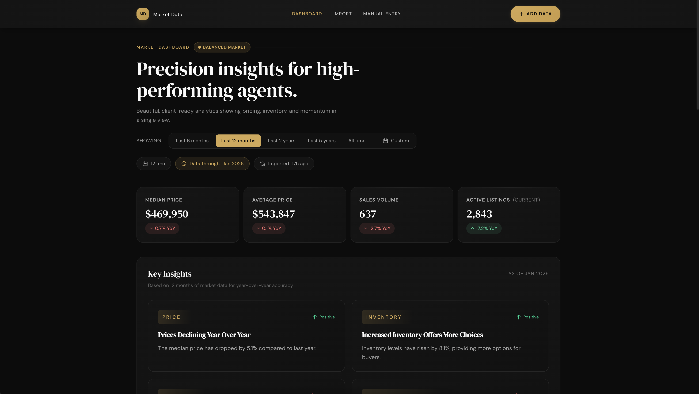
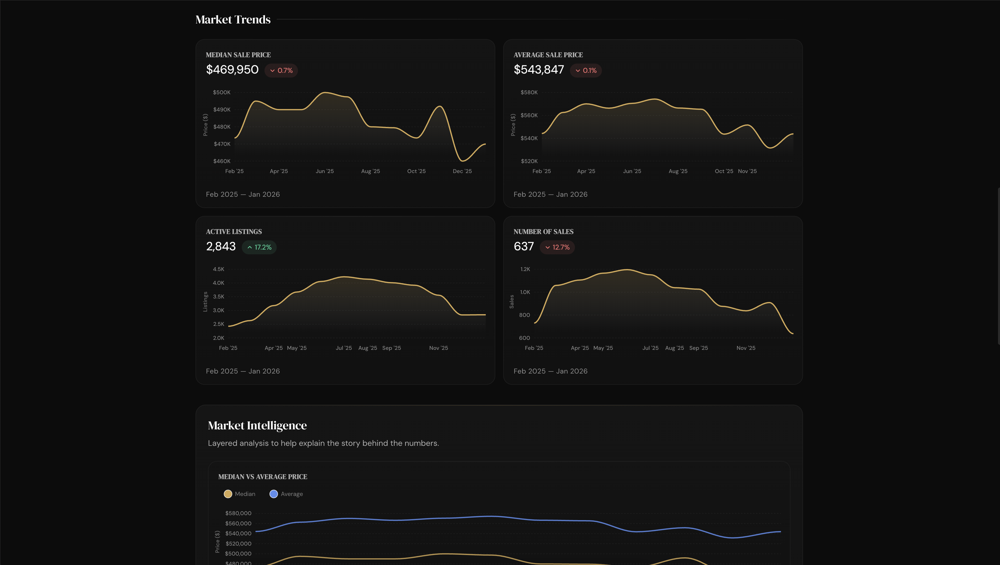
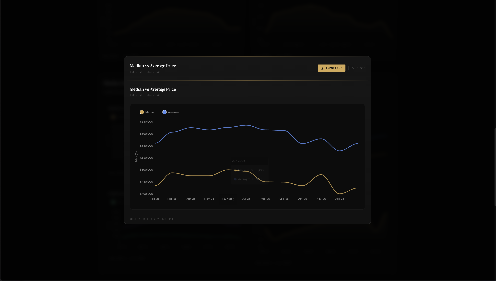
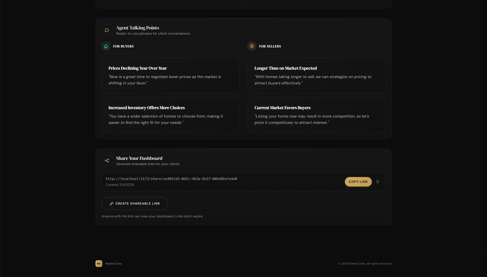

# Market Data

A modern real estate analytics dashboard for agents to visualize market trends, generate AI-powered insights, and share beautiful reports with clients.

<details>
<summary><strong>Screenshots</strong></summary>







</details>

## Features

### Dashboard & Visualization
- **Interactive Charts**: Track median price, average price, sales volume, active listings, days on market, price per square foot, months of supply, and list-to-sale ratio with smooth, animated ApexCharts
- **Multi-metric Comparisons**: Overlay charts comparing median vs average price, sales vs active inventory
- **Date Range Filtering**: View data across 6 months, 1 year, 2 years, 5 years, all time, or custom date ranges
- **Key Metrics Cards**: At-a-glance stats with period-over-period change indicators and YTD sales tracking
- **Market Condition Badge**: Visual indicator showing buyer's, seller's, or balanced market conditions
- **Chart Export**: Expand any chart and export as high-resolution PNG for presentations and reports

### AI-Powered Insights
- **GPT-4o-mini Integration**: Automatically generates market insights from your data
- **Smart Classification**: AI determines market conditions with confidence levels
- **Sentiment Analysis**: Each insight tagged as positive, negative, or neutral with visual indicators
- **Agent Talking Points**: Ready-to-use phrases for client conversations, split by buyer and seller audiences
- **Fallback System**: Rule-based insights when AI is unavailable, with seasonal pattern analysis

### Data Import
- **Excel & CSV Upload**: Drag-and-drop file upload with automatic column detection
- **Google Sheets Integration**: Import directly from public Google Sheets with tab/range support
- **Smart Extraction**: Automatically identifies date columns and metric types from various MLS report formats
- **Import History**: Track previous imports with one-click re-import for Google Sheets sources
- **Manual Entry**: Form-based data entry for individual months

### Sharing
- **Shareable Links**: Generate unique URLs to share your dashboard with clients
- **Date Range Preservation**: Shared links preserve your selected date range for consistent reporting
- **No Expiration**: Links remain active indefinitely
- **Read-only Access**: Clients see the same beautiful dashboard without edit capabilities

### Design
- **Dark Theme**: Premium dark UI with gold accents
- **Smooth Animations**: Fade-in, stagger, scale-on-hover, and count-up animations
- **Fully Responsive**: Optimized for desktop, tablet, and mobile viewing with adaptive layouts
- **Skeleton Loading**: Polished loading states during data hydration
- **Luxurious Aesthetic**: Designed to impress clients with a high-end look

## Tech Stack

| Category | Technology |
|----------|------------|
| Framework | [SvelteKit 2](https://kit.svelte.dev/) with [Svelte 5](https://svelte.dev/) |
| Language | TypeScript |
| Styling | [Tailwind CSS 4](https://tailwindcss.com/) with tailwind-merge & tailwind-variants |
| UI Components | [Bits UI](https://bits-ui.com/) |
| Database | [Supabase](https://supabase.com/) (PostgreSQL) |
| Authentication | Supabase Auth |
| AI | [OpenAI API](https://platform.openai.com/) (GPT-4o-mini) |
| Charts | [ApexCharts 5](https://apexcharts.com/) |
| Chart Export | [html2canvas](https://html2canvas.hertzen.com/) |
| Animations | [svelte-motion](https://github.com/micha-lmxt/svelte-motion) |
| Excel Parsing | [SheetJS (xlsx)](https://sheetjs.com/) |
| Deployment | [Cloudflare Pages](https://pages.cloudflare.com/) with Workers |
| Package Manager | pnpm 9+ |

## Prerequisites

- Node.js 18+
- pnpm 9+
- Supabase account
- OpenAI API key (optional, for AI insights)

## Getting Started

### 1. Clone the repository

```bash
git clone <repository-url>
cd market-data
```

### 2. Install dependencies

```bash
pnpm install
```

### 3. Set up environment variables

Create a `.env` file in the root directory:

```env
# Supabase
PUBLIC_SUPABASE_URL=https://your-project.supabase.co
PUBLIC_SUPABASE_ANON_KEY=your-anon-key

# OpenAI (optional - enables AI insights)
OPENAI_API_KEY=sk-your-openai-key
```

### 4. Set up Supabase

Create the following tables in your Supabase project:

```sql
-- Metric types (pre-populate with standard metrics)
CREATE TABLE metric_types (
  id TEXT PRIMARY KEY,
  display_name TEXT NOT NULL,
  unit TEXT,
  format_pattern TEXT,
  min_value NUMERIC,
  max_value NUMERIC
);

-- User profiles
CREATE TABLE profiles (
  id UUID PRIMARY KEY REFERENCES auth.users(id),
  email TEXT NOT NULL,
  full_name TEXT,
  created_at TIMESTAMPTZ DEFAULT NOW(),
  updated_at TIMESTAMPTZ DEFAULT NOW()
);

-- Market metrics
CREATE TABLE metrics (
  id SERIAL PRIMARY KEY,
  user_id UUID NOT NULL REFERENCES profiles(id),
  metric_type_id TEXT NOT NULL REFERENCES metric_types(id),
  recorded_date DATE NOT NULL,
  value NUMERIC NOT NULL,
  is_manually_entered BOOLEAN DEFAULT FALSE,
  created_at TIMESTAMPTZ DEFAULT NOW(),
  updated_at TIMESTAMPTZ DEFAULT NOW(),
  UNIQUE(user_id, metric_type_id, recorded_date)
);

-- Shareable links
CREATE TABLE shared_links (
  id SERIAL PRIMARY KEY,
  user_id UUID NOT NULL REFERENCES profiles(id),
  token TEXT NOT NULL UNIQUE DEFAULT gen_random_uuid(),
  created_at TIMESTAMPTZ DEFAULT NOW()
);

-- Import sources (for re-import functionality)
CREATE TABLE import_sources (
  id UUID PRIMARY KEY DEFAULT gen_random_uuid(),
  user_id UUID NOT NULL REFERENCES profiles(id),
  source_type TEXT NOT NULL CHECK (source_type IN ('google_sheets', 'csv', 'excel', 'manual')),
  source_url TEXT,
  source_name TEXT NOT NULL,
  sheet_tab TEXT,
  last_imported_at TIMESTAMPTZ DEFAULT NOW(),
  row_count INTEGER,
  created_at TIMESTAMPTZ DEFAULT NOW()
);

-- Seed metric types
INSERT INTO metric_types (id, display_name, unit, format_pattern) VALUES
  ('median_price', 'Median Sale Price', 'USD', '$#,##0'),
  ('average_price', 'Average Sale Price', 'USD', '$#,##0'),
  ('sales_count', 'Number of Sales', NULL, '#,##0'),
  ('active_listings', 'Active Listings', NULL, '#,##0'),
  ('days_on_market', 'Days on Market', 'days', '#,##0'),
  ('price_per_sqft', 'Price per Sq Ft', 'USD', '$#,##0'),
  ('months_of_supply', 'Months of Supply', 'months', '#,##0.0'),
  ('list_to_sale_ratio', 'List to Sale Ratio', '%', '#,##0.0%');
```

Enable Row Level Security (RLS) and create policies to ensure users can only access their own data.

### 5. Run the development server

```bash
pnpm dev
```

The app will be available at `http://localhost:5173`.

## Project Structure

```
src/
├── lib/
│   ├── charts/
│   │   ├── TrendChart.svelte     # Single metric area chart with export
│   │   ├── MultiTrendChart.svelte # Multi-series comparison chart
│   │   ├── MetricCard.svelte     # Stat card component
│   │   ├── Modal.svelte          # Reusable modal component
│   │   └── chartExport.ts        # PNG export utilities
│   ├── components/
│   │   ├── animations/           # Motion components (FadeIn, CountUp, etc.)
│   │   ├── DateRangePopover.svelte # Custom date range picker
│   │   └── SkeletonCard.svelte   # Loading skeleton states
│   ├── extractors/
│   │   └── excel.ts              # Excel/CSV parsing logic
│   ├── insights/
│   │   ├── enhanced-insights.ts  # Rule-based insight generation
│   │   ├── market-conditions.ts  # Market classification logic
│   │   └── seasonal-patterns.ts  # Seasonal comparison data
│   ├── database.types.ts         # Supabase type definitions
│   ├── supabase.ts               # Supabase client setup
│   └── validation.ts             # Value formatting utilities
├── routes/
│   ├── +page.svelte              # Landing page
│   ├── dashboard/
│   │   └── +page.svelte          # Main dashboard
│   ├── upload/
│   │   └── +page.svelte          # Data import page
│   ├── manual-entry/
│   │   └── +page.svelte          # Manual data entry
│   ├── share/[token]/
│   │   └── +page.svelte          # Public shared dashboard
│   └── auth/
│       └── login/                # Authentication
└── app.css                       # Global styles & Tailwind config
```

## Scripts

| Command | Description |
|---------|-------------|
| `pnpm dev` | Start development server |
| `pnpm build` | Build for production |
| `pnpm preview` | Preview production build locally |
| `pnpm check` | Run TypeScript and Svelte checks |

## Deployment

The app is configured for Cloudflare Pages deployment:

```bash
pnpm build
```

Deploy the `.svelte-kit/cloudflare` directory to Cloudflare Pages, ensuring environment variables are configured in the dashboard.

## Supported Metrics

The system automatically extracts these metrics from uploaded files:

| Metric | Common Column Names |
|--------|---------------------|
| Median Price | Median Sale Price, Median Price, Median Sold Price |
| Average Price | Average Sale Price, Avg Price, Mean Price |
| Sales Count | Number of Sales, Closed Sales, Units Sold |
| Active Listings | Active Listings, Inventory, Current Listings |
| Days on Market | Days on Market, DOM, Average DOM |
| Price per Sq Ft | Price Per Sq Ft, $/SqFt, PPSF |
| Months of Supply | Months of Supply, MOS, Absorption Rate |
| List to Sale Ratio | List to Sale Ratio, SP/LP, Sale to List |

## License

Private - All rights reserved.
