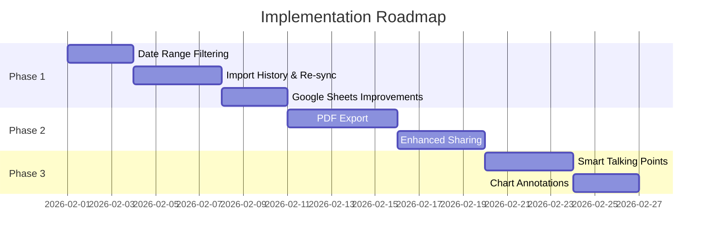

# Feature Plan: Enhanced Data Import & Agent Value Features

**Created:** 2026-01-30
**Type:** Enhancement
**Priority:** High
**Status:** Draft

---

## Overview

Transform the market data application into a feature-rich but focused tool that maximizes value for real estate agents. The core philosophy: **depth over breadth**—enhance what already works rather than adding complexity.

### Current Strengths to Build On
- Clean data import from Google Sheets and CSV ✅
- 8 core real estate metrics with validation ✅
- ApexCharts visualization with expandable modals ✅
- Auto-generated Market Intelligence & Talking Points ✅
- Shareable dashboard links ✅
- Luxury dark theme that differentiates from generic tools ✅

### What Agents Actually Need (2026 Market Context)
Based on research from [Altos Research](https://altosresearch.com/), [Matterport](https://matterport.com/blog/real-estate-agent-tools), and [HousingWire](https://www.housingwire.com/articles/ai-tools-real-estate/):

1. **Confidence to communicate** — Data that helps them guide hesitant buyers/sellers
2. **Mobile-first access** — Agents are in the field, not at desks
3. **Client-ready exports** — Professional PDFs and shareable links
4. **Hyper-local insights** — Market-specific context, not generic national data
5. **Time efficiency** — Quick imports, no manual data entry

---

## Problem Statement

The current app has solid foundations but needs refinement to become indispensable:

| Gap | Impact | Complexity |
|-----|--------|------------|
| No date range filtering | Can't show "last 6 months" vs "last 2 years" | Low |
| Single market only | Can't compare neighborhoods/markets | Medium |
| No PDF export | Agents can't print reports for clients | Medium |
| Chart customization limited | Can't highlight key moments (rate changes, etc.) | Low |
| Import is one-time only | No scheduled syncs or auto-refresh | Medium |
| Talking points are generic | Not personalized to specific data patterns | Low |

---

## Proposed Solution: Phased Enhancement

### Guiding Principles

1. **Progressive Disclosure** — Simple by default, powerful when needed
2. **Mobile-First** — Every feature works on phones
3. **No Feature Creep** — Each addition must pass the "will agents use this weekly?" test
4. **Agent Workflow** — Import → Analyze → Share → Repeat

---

## Phase 1: Enhanced Import & Filtering (Immediate Priority)

### 1.1 Improved Google Sheets Import

**Current State:** Parse public Google Sheets URLs with basic header matching.

**Enhancements:**

```
src/lib/extractors/sheets.ts
```

- [ ] Auto-detect sheet tabs and let user select which to import
- [ ] Remember last-used sheet URL per user (convenience)
- [ ] Better error messages when sheet isn't public
- [ ] Support for named ranges (e.g., `Sheet1!A1:H50`)

**Acceptance Criteria:**
- [ ] User can select specific tab from multi-tab spreadsheet
- [ ] Previously used URLs appear in dropdown for quick re-import
- [ ] Clear error: "This sheet is private. Make it public via Share → Anyone with link"

### 1.2 Date Range Filtering

**Current State:** Dashboard shows ALL data ever imported.

**Enhancement:**

```
src/routes/dashboard/+page.svelte
src/routes/dashboard/+page.server.ts
```

- [x] Add filter dropdown: "Last 6 months", "Last 12 months", "Last 2 years", "All time"
- [x] Store preference in localStorage
- [x] Apply filter server-side for performance
- [x] Show selected range in dashboard header

**Acceptance Criteria:**
- [x] Filter persists across sessions
- [x] Charts and metrics update instantly on filter change
- [x] Shared links respect the filter setting

### 1.3 Import History & Re-sync

**Current State:** One-time import, no history.

**Enhancement:**

```
src/lib/stores/importHistory.ts
src/routes/upload/+page.svelte
```

- [ ] Store import metadata (source URL, date, row count) in Supabase
- [ ] "Re-import" button to refresh data from same source
- [ ] Show last import timestamp on dashboard
- [ ] Detect and highlight new/changed values on re-import

**Database Changes:**

```sql
-- New table: import_sources
CREATE TABLE import_sources (
  id UUID PRIMARY KEY DEFAULT gen_random_uuid(),
  user_id UUID REFERENCES auth.users NOT NULL,
  source_type TEXT NOT NULL, -- 'google_sheets' | 'csv' | 'manual'
  source_url TEXT,
  source_name TEXT NOT NULL,
  last_imported_at TIMESTAMPTZ NOT NULL,
  row_count INTEGER,
  created_at TIMESTAMPTZ DEFAULT NOW()
);
```

**Acceptance Criteria:**
- [ ] User sees list of previous imports with timestamps
- [ ] One-click re-import from saved sources
- [ ] "Last updated: 2 days ago" shown on dashboard

---

## Phase 2: Client-Ready Exports

### 2.1 PDF Report Generation

**Why:** Agents need printable reports for client meetings, listing presentations, and email attachments.

```
src/lib/utils/pdfExport.ts
src/routes/dashboard/+page.svelte
```

**Implementation Options:**

| Option | Pros | Cons |
|--------|------|------|
| [jsPDF](https://github.com/parallax/jsPDF) + html2canvas | Simple, client-side | Large bundle, quality issues |
| [Puppeteer/Playwright](https://playwright.dev) server-side | Perfect quality | Requires server, slower |
| **[@react-pdf/renderer](https://react-pdf.org) style approach** | Clean templates | Would need Svelte equivalent |

**Recommended:** Use ApexCharts' built-in `dataURI()` export + jsPDF for a lightweight client-side solution.

- [ ] "Download PDF" button on dashboard
- [ ] Include: header with date range, key metrics cards, 2-4 charts, talking points
- [ ] Agent branding: name/logo placeholder at top
- [ ] Clean light-mode styling for print (dark backgrounds don't print well)

**Acceptance Criteria:**
- [ ] PDF generates in < 3 seconds
- [ ] Professional appearance suitable for client handoff
- [ ] Works on mobile (download to Files app)

### 2.2 Enhanced Shareable Links

**Current State:** Basic token-based sharing.

**Enhancements:**

```
src/routes/share/[token]/+page.svelte
src/lib/components/ShareModal.svelte
```

- [ ] Optional password protection
- [ ] Link expiration (7 days, 30 days, never)
- [ ] View count tracking
- [ ] Custom link slugs (e.g., `/share/smith-family-market-update`)

**Acceptance Criteria:**
- [ ] Agent can set password when creating link
- [ ] Dashboard shows view count per shared link
- [ ] Expired links show friendly "This report has expired" message

---

## Phase 3: Smarter Insights

### 3.1 Enhanced Talking Points

**Current State:** Generic bullet points based on data patterns.

**Enhancement:**

```
src/lib/utils/insights.ts
```

- [ ] Context-aware insights based on metric combinations
- [ ] Market condition classification: "Buyer's Market", "Seller's Market", "Balanced"
- [ ] Comparison to typical seasonal patterns
- [ ] Actionable phrasing: "Advise sellers to..." / "Tell buyers that..."

**Example Improvements:**

```typescript
// Current: "Median price increased 5% year-over-year"
// Enhanced: "Median price is up 5% YoY—stronger than typical January gains of 2-3%.
//           Position this as: 'Despite rate concerns, our market remains resilient.'"
```

**Acceptance Criteria:**
- [ ] Talking points feel personalized to the specific data
- [ ] Include suggested client conversation starters
- [ ] Highlight unusual patterns that agents should address proactively

### 3.2 Chart Annotations

**Current State:** Clean charts without contextual markers.

**Enhancement using [ApexCharts annotations](https://apexcharts.com/docs/options/annotations/):**

```
src/lib/components/TrendChart.svelte
```

- [ ] Mark significant events (Fed rate changes, seasonal peaks)
- [ ] User-addable annotations ("New school opened nearby")
- [ ] Auto-detect trend changes and highlight inflection points

**Acceptance Criteria:**
- [ ] Agents can add custom annotations to their charts
- [ ] Annotations appear on shared dashboards
- [ ] Built-in markers for major rate changes (optional toggle)

---

## Phase 4: Multi-Market Support (Future)

### 4.1 Market/Neighborhood Comparison

**Note:** This is a significant architectural change. Only pursue if agents consistently request it.

**Concept:**
- Each import tagged with a "market" label (e.g., "Downtown", "Suburbs North")
- Dashboard shows market selector
- Comparison view: side-by-side charts for 2-3 markets

**Database Changes:**

```sql
-- Add market_id to metrics table
ALTER TABLE metrics ADD COLUMN market_id UUID REFERENCES markets(id);

-- New table: markets
CREATE TABLE markets (
  id UUID PRIMARY KEY DEFAULT gen_random_uuid(),
  user_id UUID REFERENCES auth.users NOT NULL,
  name TEXT NOT NULL,
  created_at TIMESTAMPTZ DEFAULT NOW()
);
```

**Defer this phase** until Phase 1-3 are validated with users.

---

## Technical Considerations

### Performance
- Date filtering should use Supabase query params, not client-side filtering
- PDF generation should show progress indicator
- Keep bundle size under control—lazy load PDF libraries

### Mobile Experience
- All new features must work on 375px viewport
- Touch-friendly filter controls (no tiny dropdowns)
- PDF download should work via share sheet on iOS/Android

### Security
- Password-protected shares: hash passwords server-side
- Rate limit PDF generation to prevent abuse
- Validate import source URLs (prevent SSRF)

### Backward Compatibility
- Existing shared links must continue working
- Don't require re-import of existing data
- New columns should have sensible defaults

---

## Success Metrics

| Metric | Target | How to Measure |
|--------|--------|----------------|
| Import completion rate | > 90% | Track started vs completed imports |
| PDF downloads per user | 2+ per month | Analytics event |
| Shared link views | Growing MoM | Database query |
| Return usage | Weekly active | Auth session tracking |

---

## What We're NOT Building

To keep the app focused, explicitly exclude:

- ❌ CRM features (contacts, follow-ups)
- ❌ MLS direct integration (too complex, varies by region)
- ❌ Transaction management
- ❌ Lead generation tools
- ❌ AI chatbot / conversational interface
- ❌ Team/brokerage features (keep single-user focus)
- ❌ Paid tiers / subscription management

---

## Implementation Order



---

## MVP for Phase 1

Minimum viable implementation for immediate value:

### `src/routes/dashboard/+page.svelte`

```svelte
<!-- Date range filter component -->
<script>
  let dateRange = $state('12m'); // '6m', '12m', '24m', 'all'

  const filterOptions = [
    { value: '6m', label: 'Last 6 months' },
    { value: '12m', label: 'Last 12 months' },
    { value: '24m', label: 'Last 2 years' },
    { value: 'all', label: 'All time' }
  ];
</script>

<div class="flex items-center gap-4 mb-6">
  <label class="text-sm text-gray-400">Showing:</label>
  <select
    bind:value={dateRange}
    class="bg-card border border-border rounded px-3 py-2 text-sm"
  >
    {#each filterOptions as opt}
      <option value={opt.value}>{opt.label}</option>
    {/each}
  </select>
</div>
```

### `src/routes/dashboard/+page.server.ts`

```typescript
// Add date filtering to metrics query
export const load = async ({ locals, url }) => {
  const range = url.searchParams.get('range') || '12m';

  const cutoffDate = getCutoffDate(range); // Helper function

  const { data: metrics } = await supabase
    .from('metrics')
    .select('*')
    .eq('user_id', userId)
    .gte('recorded_date', cutoffDate.toISOString())
    .order('recorded_date', { ascending: true });

  return { metrics, range };
};

function getCutoffDate(range: string): Date {
  const now = new Date();
  switch (range) {
    case '6m': return new Date(now.setMonth(now.getMonth() - 6));
    case '12m': return new Date(now.setFullYear(now.getFullYear() - 1));
    case '24m': return new Date(now.setFullYear(now.getFullYear() - 2));
    default: return new Date('1970-01-01');
  }
}
```

---

## References & Research

### Internal References
- Current extraction logic: `src/lib/extractors/excel.ts:1-200`
- Chart components: `src/lib/components/TrendChart.svelte`
- Dashboard page: `src/routes/dashboard/+page.svelte`
- Sharing implementation: `src/routes/share/[token]/+page.svelte`

### External References
- [ApexCharts Synchronized Charts](https://apexcharts.com/docs/chart-types/synchronized-charts/)
- [ApexCharts Dashboard Examples](https://apexcharts.com/javascript-chart-demos/dashboards/)
- [Altos Research](https://altosresearch.com/) - Market data tool benchmark
- [Real Estate Agent Tools 2025](https://matterport.com/blog/real-estate-agent-tools)
- [AI Tools for Real Estate](https://www.housingwire.com/articles/ai-tools-real-estate/)

### Design Inspiration
- Current app aesthetic: Luxury dark theme with gold (#d4a853) accents
- Maintain premium feel while adding functionality
- Reference: [Smashing Magazine - ApexCharts Guide](https://www.smashingmagazine.com/2020/11/data-visualization-apexcharts/)

---

## Open Questions

### Critical (Must Resolve Before Implementation)

1. **Re-import conflict resolution:** If an agent manually edited a metric value, then re-imports with a different value from the source, which wins?
   - *Recommendation:* Re-import overwrites all values with warning shown first

2. **Guest permissions on shared links:** Can viewers on shared dashboards change the date filter or export PDF?
   - *Recommendation:* Guests see owner's filter setting, cannot change it, cannot export PDF

3. **CSV re-import:** Google Sheets have persistent URLs, but CSVs are file uploads. How should "re-import" work for CSVs?
   - *Recommendation:* Show "Upload same file again" prompt; track by filename for history

4. **Data size limits:** What's the maximum rows per import and date range span to prevent performance issues?
   - *Recommendation:* 1000 rows per import, 5 years of data, 500 chart data points max

### Important (Resolve During Implementation)

5. **PDF branding:** Should agents be able to upload their logo, or keep it simple with text-only branding?
   - *Recommendation:* Text-only initially (agent name from profile); logo upload as future enhancement

6. **Filter sync between localStorage and URL:** URL param takes precedence? localStorage fallback?
   - *Recommendation:* URL param wins; localStorage is fallback when no param

7. **Mobile annotation interaction:** Desktop uses click; what gesture for mobile?
   - *Recommendation:* Double-tap on chart opens annotation modal with date pre-selected

### Nice-to-Have (Can Defer)

8. **Import scheduling:** Is manual re-import sufficient, or do agents want automatic weekly syncs?
9. **Quarter presets:** Should date filter include Q1, Q2, etc. in addition to month ranges?
10. **Market comparison:** How many agents work across multiple markets vs. single-market focus?

---

## Key User Flows & Edge Cases

### Flow: Date Range Filtering
```
User lands on dashboard → Load filter from localStorage or default (12m)
        ↓
User changes filter → Update URL param → Server re-fetches filtered data
        ↓
Charts/metrics update → Save preference to localStorage
        ↓
User shares link → Shared link includes filter param
```

**Edge Cases:**
- User has "12m" saved in localStorage, opens shared link with "6m" param → URL param wins
- Filter change on slow network → Show loading state, debounce rapid changes
- No data in selected range → Show empty state with "No data for this period"

### Flow: Google Sheets Tab Selection
```
User enters URL → System fetches sheet metadata → Display available tabs
        ↓
[Sheet private?] → Show "Make public via Share → Anyone with link" message
        ↓
User selects tab → Extract data from tab → Preview & confirm
```

**Edge Cases:**
- Sheet has 10+ tabs → Scrollable dropdown with search
- Tab names contain special characters → URL-encode properly
- Google rate limits (429) → "Too many requests. Try again in a moment."

### Flow: Import History & Re-sync
```
User imports data → System stores import_source record with metadata
        ↓
User views import history → Display list with timestamps & row counts
        ↓
User clicks "Re-import" → Fetch from original source
        ↓
[Values changed?] → Highlight diff, ask for confirmation
        ↓
User confirms → Upsert metrics
```

**Edge Cases:**
- Source URL no longer exists → "Could not reach source. URL may have changed."
- Re-import has fewer rows than original → Warn about potential data removal
- Manual edits exist → Show warning before overwriting

### Flow: PDF Export
```
User clicks "Download PDF" → Show progress indicator (modal with spinner)
        ↓
Capture charts via ApexCharts dataURI() → Generate PDF with jsPDF
        ↓
Apply light-mode styling for print → Include header + metrics + charts + talking points
        ↓
Trigger download → [Mobile: save to Files app via share sheet]
```

**Edge Cases:**
- Chart render fails → Skip chart, show placeholder with "Chart unavailable"
- Large dataset = slow generation → Show progress percentage
- Mobile Safari → Use share sheet for "Save to Files" option

---

## Next Steps

1. Review and approve this plan
2. Start with Phase 1.2 (Date Range Filtering) as quickest win
3. Gather user feedback before proceeding to Phase 2
